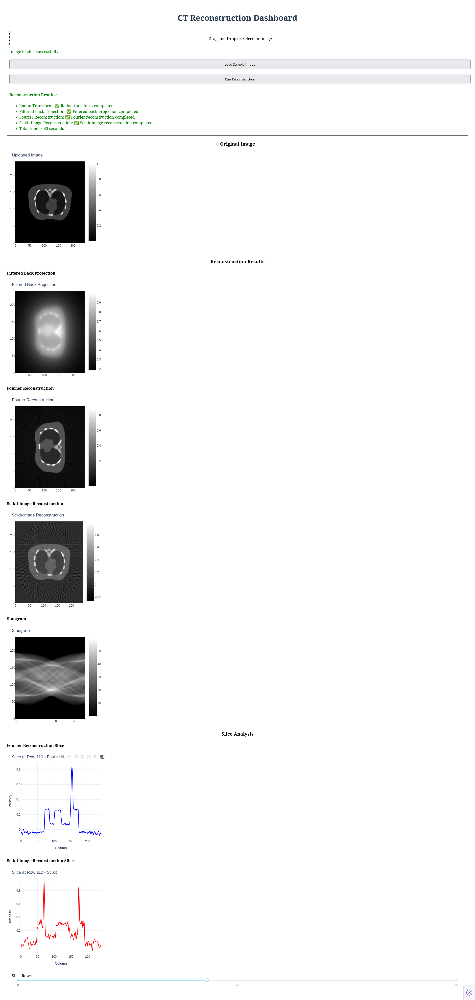

# learning tomographic reconstruction

## Introduction

we get from Tomographic-Reconstruction,change:
* use uv env to install dependencies.
* use plotly,dash to show the result.

## use 
```sh
uv run reconstructor_plot.py
```
or
```sh
uv run reconstructor_dash.py
```
## result

* plotly: show the result in browser.
* dash: show the result in browser.
Dash is running on http://0.0.0.0:8050/



## thanks

Tomographic-Reconstruction

https://github.com/guibo-tech/Tomographic-Reconstruction

This project demonstrates the process of reconstructing images from tomographic data using custom methods. The primary focus is on the Shepp-Logan phantom, a widely used digital phantom for testing and validating image reconstruction algorithms.
